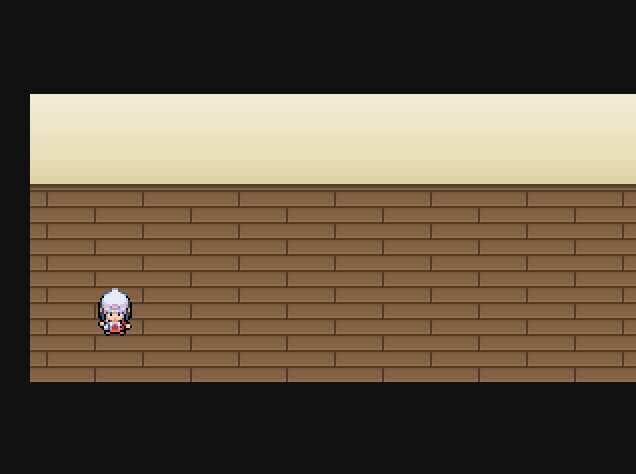
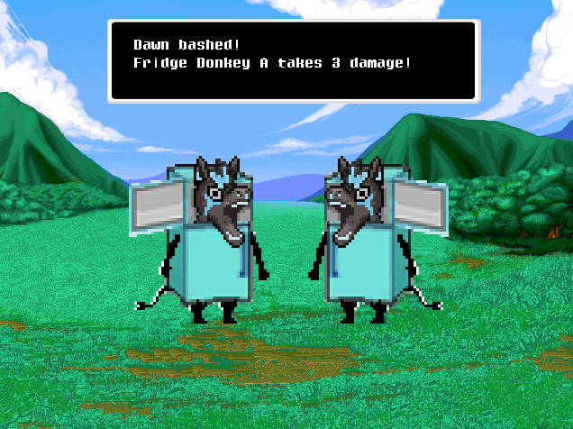

# Personal Project: Retro RPG Base Demo

This project is the "base" of a retro RPG, made using C++ and SDL2. 

In it, users can move around an animated character from a top-down perspective and try out a Dragon-Quest-Inspired turn based battle system. However, there is no narrative as this project was meant to be a base that can be built upon to create a more traditional RPG experience.

## Project Dependencies   

### SDL2  
[Simple DirectMedia Layer (SDL2)](https://www.libsdl.org/) is a cross-platform library used for handling:  
- **Window management** – Creating and managing the game window.  
- **Rendering** – Hardware-accelerated rendering of textures and sprites.  
- **Input handling** – Processing keyboard input for player controls.  

### SDL2_image  
[SDL2_image](https://github.com/libsdl-org/SDL_image) is an extension of SDL2 that allows the project to load and render image files such as **PNG** and **JPG**, which are used for sprites and textures.  

### SDL2_ttf  
[SDL2_ttf](https://github.com/libsdl-org/SDL_ttf) provides support for rendering text using **TrueType Fonts (TTF)**. It is used in this project to display UI elements such as dialogue, menus, and battle text.  

---

## Initial Project Goals
- Gain experience with a new programming language (C++)
- Deepen understanding of object-oriented programming
- Explore design patterns
- Develop a graphical windowed application

## Architecture Summary
### Finite Hierarchical State Machine  
The project employs a **finite hierarchical state machine** to manage different game states.  

#### High-Level Game States:  
- **Title Screen State** – Handles the game's main menu and navigation.  
- **Overworld State** – Manages player movement, environment interaction, and transitioning into battles.  
- **Battle State** – Controls the battle system, handling player and enemy actions.  

#### Battle Substates:  
Within the **Battle State**, multiple substates manage different aspects of combat:  
- **Battle Menu State** – Displays options for the player (Attack, Arts, Items, etc.).  
- **Battle Action State** – Executes player and enemy actions, processes damage, and checks battle conditions.  
  
### Entity-Component System (ECS)

The project uses the **Entity-Component System (ECS)**. Instead of relying on inheritance and polymorphism to define an entity's properties and behavior, ECS organizes game objects into three parts:  

- **Entities** – Simple IDs or containers that hold components.  
- **Components** – Modular data containers that define an entity’s attributes (e.g., `PositionComponent`, `VelocityComponent`).  
- **Systems** – Operate on entities with specific components to apply logic (e.g., `RenderSystem` draws all entities with a `SpriteComponent`).  

## Installation  

📥 **[Download Here](https://drive.google.com/drive/folders/1mu17CrUFQ0IOZUafWYAz-7phamCB2YOR?usp=sharing)**  

### Running the Game  
1. Download and extract the folder.  
2. Run the executable file (`main.exe`).  

Note: This is a Windows-only build. To run the game on macOS or Linux, you will need to compile the project from source using the appropriate development tools for your platform.

